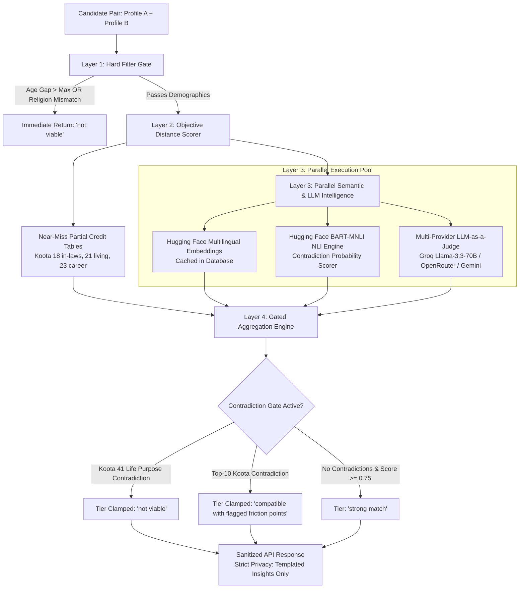

# 💍 Koota Match Engine

> **A High-Precision, Zero-Cost 42-Koota Marital Compatibility Engine Tailored for Indian Cultural & Psychological Realities.**

[](https://github.com/yashwoodstock-blip/koota-match-engine/actions/workflows/ci.yml)
[](https://fastapi.tiangolo.com)
[](https://www.python.org/)
[](https://supabase.com)
[](https://groq.com)
[](https://huggingface.co)
[-brightgreen?style=flat)](#-zero-cost-deployment-architecture)

---

## 📖 Executive Summary

The **Koota Match Engine** replaces archaic astrology-based matchmaking with an empirical, multi-dimensional psychometric framework. Expanding traditional Indian matrimonial criteria into **42 scientific Kootas across 14 life pillars**, the engine blends deterministic objective logic, transformer embeddings, natural language inference (NLI), and multi-provider LLM-as-a-Judge reasoning to deliver actionable compatibility scores without exposing sensitive private text.

---

## 🏛️ The 42-Koota Domain Framework

The engine categorizes marriage readiness and long-term marital stability across 14 Pillars weighted on a research-calibrated scale ($w1$ to $w15$):

```
                                    42-KOOTA PILLAR WEIGHTS
  15 ──┐                                                                   █
  14 ──┼─────────────────────────────█─────────────────────────────────────█
  13 ──┼─────────────────────────────█─────────────────────────────────────█
  12 ──┼───────────────█─────────────█───────────────█─────────────────────█
  10 ──┼───────█───────█─────────────█───────█───────█───────█─────────────█
   8 ──┼───────█───────█───────█─────█───────█───────█───────█───────█─────█
   6 ──┼───────█───█───█───█───█───█─█───█───█───█───█───█───█───█───█───█─█
   4 ──┼───█───█───█───█───█───█───█─█───█───█───█───█───█───█───█───█───█─█
   0 ──┴───A───B───C───D───E───F───G─H───I───J───K───L───M───N───O───P───Q─R
```

### Pillar Hierarchy & Weighting ($w1$–$w15$)

| Pillar | Focus Area | Weight Range | Key India-Centric Realities Evaluated |
| :--- | :--- | :---: | :--- |
| **Pillar A** | Knowing Each Other (Love Maps) | $w4$–$w6$ | Emotional vulnerability, childhood histories, career ambition trajectories. |
| **Pillar B** | Fondness, Admiration & Respect | $w6$–$w10$ | Public appreciation, gratitude habits, caste/social status egalitarianism. |
| **Pillar C** | Emotional Attunement & Bids | $w6$–$w8$ | Responsiveness to emotional bids, social battery management in joint family setups. |
| **Pillar D** | Mutual Influence & Decision Making | $w10$–$w12$ | Financial purchase autonomy, veto dynamics, career vs family trade-offs. |
| **Pillar E** | Conflict Style & De-escalation | $w8$–$w10$ | Stonewalling vs immediate engagement, repair attempts during heated domestic arguments. |
| **Pillar F** | In-Law Dynamics & Elder Care | **$w10$–$w14$** | **Co-residence expectations, elder care division among siblings, parent boundary enforcement.** |
| **Pillar G** | Career Continuity & Gender Roles | **$w10$–$w14$** | **Dual-career relocations, domestic chore distribution, postpartum career restarts.** |
| **Pillar H** | Financial Architecture & Money Values | $w10$–$w12$ | Joint vs separate accounts, parental financial remittances, risk tolerance in investments. |
| **Pillar I** | Parenting Philosophy & Family Size | $w8$–$w12$ | Timeline to children, disciplinary philosophy, grandparent involvement boundaries. |
| **Pillar J** | Intimacy, Affection & Physical Needs | $w6$–$w10$ | Communication comfort regarding intimacy, non-sexual physical affection frequency. |
| **Pillar K** | Social Architecture & Community | $w4$–$w8$ | Community obligations, festival celebrations, friend circle boundary management. |
| **Pillar L** | Crisis Resilience & Life Transitions | $w8$–$w12$ | Health crises, economic downturn handling, sabbatical support agreements. |
| **Pillar M** | Shared Meaning & Life Purpose | **$w14$–$w15$** | **Existential purpose of marriage, spiritual/philosophical alignment, core life legacy.** |
| **Pillar N** | Hard Demographics & Filters | **Filter / $w1$** | **Age gap threshold ($\le 2$ yrs default), religion exact match, caste requirements.** |

---

## ⚡ 4-Layer Intelligence Architecture



### 1. Layer 1: Hard Filter Short-Circuit
- **Age Gap Gate**: Calculates $|\text{Age}_A - \text{Age}_B| \le \text{max\_age\_gap}$ (default: 2 years).
- **Religion Match Gate**: Enforces exact normalized match (`Hindu` == `Hindu`, `Muslim` == `Muslim`, `Sikh` == `Sikh`, etc.).
- **Caste Requirement Gate**: If either party sets `caste_preference == "required"`, verifies exact sub-caste match. If non-viable, execution terminates immediately in $< 1\text{ms}$ with zero downstream LLM/embedding compute cost.

### 2. Layer 2: Objective Near-Miss Scorer
- **Numeric Distance**: Scaled linear decay:
  $$S_{\text{num}} = \max\left(0.0, 1.0 - \frac{|v_A - v_B|}{\text{Range}}\right)$$
- **India-Context Partial Credit Matrices**:
  - *Living Arrangements (Koota 21)*: Same city separate unit vs joint family yields calibrated $0.50$ partial compatibility rather than a binary zero.
  - *In-Law Deference (Koota 18)*: Autonomous decisions with parental consultation scores $0.75$ with joint family deference.

### 3. Layer 3: Semantic Embeddings, NLI & LLM Judge
- **Vector Embeddings**: `sentence-transformers/paraphrase-multilingual-MiniLM-L12-v2` generates 384-dimensional vector representations stored in database vector caches.
- **NLI Contradiction Scorer**: `facebook/bart-large-mnli` computes entailment, neutral, and contradiction probabilities:
  $$S_{\text{NLI}} = \max\Big(0.0, \min\big(1.0, P(\text{Entailment}) + 0.40 \cdot P(\text{Neutral}) - 0.70 \cdot P(\text{Contradiction})\big)\Big)$$
  Flags $P(\text{Contradiction}) \ge 0.50$ as an active contradiction veto.
- **Multi-Provider LLM-as-a-Judge**: Evaluates top subjective Kootas concurrently:
  - **Groq Free Tier**: `llama-3.3-70b-versatile` ($30\text{ RPM}$)
  - **OpenRouter Free Models**: `nvidia/nemotron-3.5-lightning:free` & `google/gemma-4-26b-a4b-it:free`
  - **Gemini Free Tier**: `gemini-2.0-flash` ($15\text{ RPM}$)
  - **Strict Structured JSON Schema**:
    ```json
    {
      "agreement_score": 0.90,
      "contradiction": false,
      "reasoning": "Both candidates view marriage as a lifelong partnership focused on mutual growth.",
      "key_tensions": []
    }
    ```

### 4. Layer 4: Gated Aggregation Mathematics
- Replaces naive weighted averages with non-linear veto gates:
  1. **Existential Veto (Koota 41 Life Purpose)**: A contradiction on "what is marriage for" strictly clamps the match tier to `"not viable"`.
  2. **Top-10 Contradiction Ceiling**: A contradiction on Koota 18 (In-Laws) or Koota 23 (Career) enforces a hard ceiling of `"compatible with flagged friction points"`, making a `"strong match"` mathematically impossible.
  3. **Multiplicative Penalty**:
     $$\text{Score}_{\text{gated}} = \text{Score}_{\text{composite}} \times \prod_{g \in \text{Gates}} \text{penalty}_g$$

---

## 🔒 Privacy Architecture

To comply with matrimonial privacy best practices:
- **Zero Raw Free-Text Answers** are ever exposed in any API response.
- **Zero Demographic Data** (income, caste, raw age) is leaked in match responses.
- **Sanitized Outputs Only**: Responses return computed numeric scores, compatibility tiers, divergence flags, contradiction gate notes, and curated templated insights.

---

## 📁 Repository Directory Map

```text
koota-match-engine/
├── .github/
│   └── workflows/
│       ├── ci.yml                 # Automated pytest CI runner on every push/PR
│       └── keepalive.yml          # Cron job running every 3 days to keep Render & Supabase awake
├── app/
│   ├── api/
│   │   ├── routes_match.py        # POST /match/{id_a}/{id_b} and GET /match/{id}/candidates
│   │   ├── routes_profiles.py     # Profile CRUD and bulk answer submission with auto-embedding
│   │   └── schemas.py             # Pydantic v2 request/response validation contracts
│   ├── db/
│   │   ├── kootas.json            # Complete 42-Koota Question Bank across 14 Pillars
│   │   ├── seed_kootas.py         # Database seeder to initialize and verify all 42 Kootas
│   │   ├── seed_synthetic.py      # Seeder for 16 realistic edge-case profiles
│   │   └── session.py             # SQLAlchemy 2.0 async session and engine factory
│   ├── scoring/
│   │   ├── aggregate.py           # Gated aggregation math & contradiction gate detector
│   │   ├── llm_judge.py           # Multi-provider Groq / OpenRouter / Gemini Judge engine
│   │   ├── nli.py                 # Hugging Face NLI contradiction scorer
│   │   ├── objective.py           # Hard filter short-circuit & objective partial credit logic
│   │   ├── semantic.py            # Sentence similarity, embedding cache, and vector cosine math
│   │   └── tiers.py               # 3-tier classifier and 42 curated domain insight templates
│   ├── config.py                  # Pydantic Settings loading environment variables
│   ├── main.py                    # FastAPI app initialization, lifespan hooks, CORS, and healthcheck
│   └── models.py                  # SQLAlchemy ORM models (Profile, Answer, Koota, MatchResult)
├── tests/
│   ├── conftest.py                # Pytest fixtures and in-memory test database setup
│   ├── synthetic_profiles.json    # 16 complete synthetic profiles with diverse edge-case traits
│   ├── test_aggregation.py        # Tests for score weighting and divergence detection
│   ├── test_api_and_tiers.py      # End-to-end API lifecycle and tier classification tests
│   ├── test_gated_aggregation.py  # Tests for Koota 41 veto and Top-10 contradiction ceilings
│   ├── test_llm_judge.py          # Unit tests for multi-provider LLM Judge and fallbacks
│   ├── test_nli_scorer.py         # Tests for NLI entailment and contradiction formulas
│   ├── test_objective_scorer.py   # Tests for age gap, religion match, and partial credit matrices
│   ├── test_phase1_scaffolding.py # Basic scaffolding, health check, and JSON schema tests
│   ├── test_semantic_scorer.py    # Tests for vector caching and cosine similarity math
│   └── test_synthetic_matching.py # Edge-case assertions on 16 synthetic candidate pairs
├── .env.example                   # Annotated template for all required API keys
├── requirements.txt               # Pinned production Python dependencies
└── README.md                      # Complete system documentation
```

---

## 🔌 API Reference

### 1. Health Check
```http
GET /health
```
**Response (200 OK):**
```json
{
  "status": "healthy",
  "service": "koota-match-engine",
  "version": "1.0.0"
}
```

---

### 2. Create Profile
```http
POST /profiles/
Content-Type: application/json

{
  "name": "Aarav Sharma",
  "age": 28,
  "gender": "male",
  "religion": "Hindu",
  "caste": "Brahmin",
  "caste_preference": "no_preference",
  "city": "Bengaluru"
}
```
**Response (201 Created):**
```json
{
  "id": "c1f3b89e-2d4e-4f1b-8a12-9c2b4d8e7a1b",
  "name": "Aarav Sharma",
  "is_complete": false,
  "answered_kootas_count": 0,
  "total_kootas_count": 42,
  "created_at": "2026-08-17T02:50:00Z"
}
```

---

### 3. Submit Answers
```http
POST /profiles/{profile_id}/answers
Content-Type: application/json

{
  "answers": [
    {
      "koota_id": 18,
      "question_index": 0,
      "question_type": "objective",
      "raw_value": "weekly joint dinners with separate home"
    },
    {
      "koota_id": 18,
      "question_index": 0,
      "question_type": "subjective",
      "raw_value": "I believe in healthy weekly visits with in-laws while preserving our household privacy."
    }
  ]
}
```

---

### 4. Pairwise Match Evaluation
```http
POST /match/{profile_a_id}/{profile_b_id}?max_age_gap=2
```
**Response (200 OK):**
```json
{
  "profile_a_id": "syn-01-aarav",
  "profile_b_id": "syn-02-ananya",
  "is_viable": true,
  "tier": "strong match",
  "overall_score": 0.9136,
  "raw_composite_score": 0.9136,
  "objective_score": 0.9250,
  "semantic_score": 0.9022,
  "tier_ceiling": null,
  "alignment_points": [
    "Deep philosophical consensus on the transcendent purpose and companionship of marriage.",
    "High resonance on in-law engagement rhythm and balanced filial boundaries."
  ],
  "friction_points": [],
  "disagreement_flags": [],
  "contradiction_gates": [],
  "llm_judge_insights": {
    "41": {
      "koota_id": 41,
      "agreement_score": 0.95,
      "contradiction": false,
      "reasoning": "Both candidates view marriage as an equal partnership for companionship and growth.",
      "key_tensions": [],
      "provider_used": "groq"
    }
  },
  "hard_filter_reason": null
}
```

---

### 5. Ranked Candidate Discovery
```http
GET /match/{profile_id}/candidates?min_score=0.70&max_age_gap=2
```
**Response (200 OK):**
```json
[
  {
    "candidate_id": "syn-02-ananya",
    "candidate_name": "Ananya Iyer",
    "is_viable": true,
    "tier": "strong match",
    "overall_score": 0.9136,
    "alignment_points": [
      "Deep philosophical consensus on the transcendent purpose of marriage."
    ],
    "friction_points": [],
    "disagreement_count": 0,
    "contradiction_count": 0
  }
]
```

---

## 🧪 Automated Test Suite (39 Tests)

The engine features a comprehensive, 100% passing test suite across 8 modules:

```text
tests/test_phase1_scaffolding.py                 [3/3 passed]
tests/test_objective_scorer.py                   [8/8 passed]
tests/test_semantic_scorer.py                    [6/6 passed]
tests/test_nli_scorer.py                         [3/3 passed]
tests/test_llm_judge.py                          [4/4 passed]
tests/test_gated_aggregation.py                  [2/2 passed]
tests/test_api_and_tiers.py                      [4/4 passed]
tests/test_aggregation.py                        [3/3 passed]
tests/test_synthetic_matching.py                 [6/6 passed]
======================== 39 passed in 2.61s ========================
```

---

## 🚀 Local Development Setup

### 1. Clone & Install Dependencies
```bash
git clone https://github.com/yashwoodstock-blip/koota-match-engine.git
cd koota-match-engine
python -m venv venv
source venv/bin/activate  # On Windows: .\venv\Scripts\activate
pip install -r requirements.txt
```

### 2. Configure Environment Variables
Copy `.env.example` to `.env` and fill in your free API keys:
```bash
cp .env.example .env
```

```ini
DATABASE_URL=sqlite+aiosqlite:///./koota.db
SUPABASE_URL=https://<your-project-ref>.supabase.co
SUPABASE_KEY=<your-supabase-key>
HF_API_TOKEN=hf_...
GROQ_API_KEY=gsk_...
OPENROUTER_API_KEY=sk-or-v1-...
```

### 3. Seed Database
```bash
# Seed the 42 Kootas into the database
python -m app.db.seed_kootas

# (Optional) Seed 16 synthetic test profiles
python -m app.db.seed_synthetic
```

### 4. Run Server
```bash
uvicorn app.main:app --reload
```
Interactive Swagger UI: **`http://127.0.0.1:8000/docs`**

### 5. Run Tests
```bash
pytest -v
```

---

## 🌐 Zero-Cost Deployment Architecture

The engine is engineered to run permanently on free-tier infrastructure ($0.00/month):

```
┌────────────────────────┐      ┌────────────────────────┐      ┌────────────────────────┐
│  Render Free Web App   │      │  Supabase Free Postgres│      │  GitHub Actions Cron   │
│  FastAPI Application   │◄────►│  Postgres + pgvector   │◄────►│  Keepalive (every 3d)  │
└────────────────────────┘      └────────────────────────┘      └────────────────────────┘
            │                                                                │
            ▼                                                                ▼
┌────────────────────────┐      ┌────────────────────────┐      ┌────────────────────────┐
│  Groq Free LLM Tier    │      │  OpenRouter Free Pool  │      │  Hugging Face Serverless│
│  Llama-3.3-70B (30 RPM)│      │  Nemotron & Gemma-4    │      │  MiniLM & BART-MNLI    │
└────────────────────────┘      └────────────────────────┘      └────────────────────────┘
```

- **Render Web Service**: Deploys via Docker or Python runtime.
- **Supabase PostgreSQL**: Free 500MB cloud database with full vector indexing support.
- **GitHub Keep-Alive Action**: Pings the Render service and Supabase REST endpoints every 3 days to prevent inactivity pause.

---

## 📜 License & Acknowledgements

- **License**: MIT License
- **Framework Inspiration**: Derived from classical 36-Guna Kundali matching re-imagined through modern marital psychological research (Gottman Sound Relationship House, Attachment Theory, and Contemporary Indian Family Sociology).
