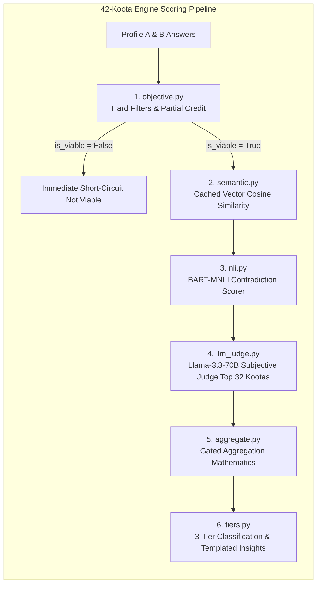
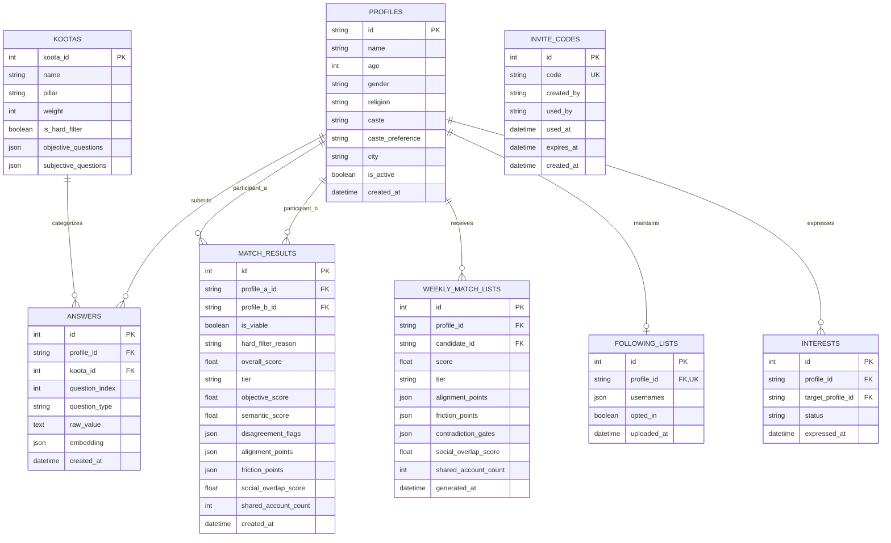

# 💍 Koota Match Engine: Comprehensive Technical Reference Manual

---

## 1. Executive Overview & System Purpose

The **Koota Match Engine** is an enterprise-grade, high-precision psychometric marital matching engine designed specifically for the nuanced sociocultural, psychological, and demographic realities of modern Indian matrimony. 

Traditional Indian matrimonial systems rely on archaic astrological heuristics (*Ashtakoota* / 36 *Gunas*) or superficial superficial filters (caste, salary, physical height). In contrast, the Koota Match Engine expands compatibility into **42 scientific Kootas grouped across 14 life pillars**. It couples deterministic hard-filter gatekeepers, vector similarity embeddings, Natural Language Inference (NLI) contradiction screens, multi-provider Large Language Model (LLM) judges, and client-side social graph overlap analysis into a precomputed batch funnel—all engineered to operate permanently within a **zero-cost ($0.00/month) cloud architecture**.

---

## 2. Architecture & Design Overview

```mermaid
graph TD
    subgraph Client & Auth Layer
        UI[Client Application / Web Frontend] -->|1. Submit Invite Code| API_INVITE[/auth/invite/redeem]
        UI -->|2. Google OAuth Token| API_AUTH[/auth/google/callback]
        UI -->|3. Client-side Following JSON| API_FOLLOW[/profiles/{id}/following]
    end

    subgraph Data Ingestion & Profile Assembly
        API_AUTH --> DB_PROFILE[(Supabase PostgreSQL Profile Table)]
        UI -->|4. 42-Koota Answers| API_ANSWERS[/profiles/{id}/answers]
        API_ANSWERS -->|Write-Time Vector Embedding| HF_EMB[HF MiniLM Embedding Model]
        HF_EMB --> DB_ANSWERS[(Answers Table / Caches)]
    end

    subgraph Weekly Precomputation Funnel [Sunday 00:00 UTC Cron]
        CRON[GitHub Actions Weekly Match Cron] --> BATCH[Batch Runner / candidates_batch.py]
        BATCH --> S1[Stage 1: SQL Indexed Hard Filter]
        S1 -->|Age Gap <= 2 yrs + Religion Match| S2[Stage 2: pgvector / Cosine ANN Retrieval Top 50]
        S2 -->|Koota 41 Life Purpose Embedding| S3[Stage 3: HF BART-MNLI Contradiction Screen Top 10]
        S3 -->|Drop Fundamental Contradictions| S4[Stage 4: Multi-Provider LLM Judge Shortlist Top 10]
        S4 -->|Groq Llama-3.3-70B / OpenRouter / Gemini| S5[Stage 5: Gated Aggregation & Tier Classification]
        S5 --> DB_WEEKLY[(WeeklyMatchList Table)]
    end

    subgraph Discovery & Mutual Interaction
        UI -->|5. Fast Read-Only Lookup| API_WEEKLY[/profiles/{id}/weekly-matches]
        DB_WEEKLY --> API_WEEKLY
        UI -->|6. Express / Decline Interest| API_INTEREST[/interest]
        API_INTEREST -->|Atomic Mutual Flip Guarantee| DB_INTEREST[(Interests Table)]
    end
```

### Architectural Design Patterns
1. **Pipelined Filter-and-Refine Funnel**: Employs monotonically narrowing stages (SQL Hard Filter $\rightarrow$ Vector ANN $\rightarrow$ NLI Contradiction Classifier $\rightarrow$ LLM Judge $\rightarrow$ Gated Aggregator) to minimize computational overhead and stay within strict free-tier rate limits.
2. **Write-Time Heavy, Read-Time Instant (CQRS-lite)**: Expensive transformer embeddings are computed and cached when users submit answers (`/profiles/{id}/answers`). Candidate matches are precomputed on a weekly scheduled cadence. User-facing match queries (`/profiles/{id}/weekly-matches`) execute as $O(1)$ constant-time database lookups with zero live LLM or transformer invocations.
3. **Multi-Provider Fallback Chain with Circuit Breaking**: The LLM-as-a-Judge subsystem utilizes a primary provider (Groq Llama-3.3-70B) and falls back sequentially to OpenRouter (Nemotron-70B/Gemma-4) and Google Gemini without halting match batch processing.
4. **Token Bucket Rate Limiting**: Uses a sliding window timestamp tracker (`GroqRateLimiter`) that guarantees execution never exceeds 25 requests per minute, preventing HTTP 429 throttling on free LLM APIs.
5. **Staged Disclosure & Zero-Knowledge Output Serialization**: Responses never serialize raw free-text answers, demographic indicators (caste, income, exact age), or raw social following lists. Match endpoints expose only numeric scores, curated templated insights, and aggregate Jaccard overlap ratios. Unilateral interest states remain completely hidden until mutuality is achieved.

---

## 3. Complete Codebase Directory & File Inventory

```text
koota-match-engine/
├── .github/
│   └── workflows/
│       ├── ci.yml                 # Automated pytest CI runner on every push/PR
│       ├── keepalive.yml          # Free-tier keepalive ping workflow (every 3 days)
│       └── weekly-match.yml       # Scheduled Sunday cron precomputing weekly matches
├── app/
│   ├── __init__.py                # App package initialization
│   ├── main.py                    # FastAPI entrypoint, lifespan hooks, and router mounting
│   ├── models.py                  # SQLAlchemy 2.0 ORM domain entities and relationships
│   ├── api/
│   │   ├── __init__.py            # API package initialization
│   │   ├── routes_auth.py         # Invite code generation, validation, and Google OAuth endpoints
│   │   ├── routes_following.py    # Opt-in client-extracted social following list endpoints
│   │   ├── routes_interest.py     # Mutual-interest expression, decline, and status routes
│   │   ├── routes_match.py        # Direct pair match scoring and candidate ranking endpoints
│   │   ├── routes_profiles.py     # Profile CRUD, 42-Koota answer submission, and completion status
│   │   ├── routes_weekly.py       # Constant-time read-only weekly matches API
│   │   └── schemas.py             # Pydantic v2 validation contracts and Data Transfer Objects (DTOs)
│   ├── auth/
│   │   ├── google_oauth.py        # Supabase Google OAuth verification and profile mapping
│   │   └── invite.py              # Single-use HMAC-signed invite code lifecycle management
│   ├── db/
│   │   ├── __init__.py            # Database package initialization
│   │   ├── kootas.json            # 42-Koota Question Bank across 14 life pillars
│   │   ├── seed_kootas.py         # Database seeder for initializing all 42 Kootas
│   │   ├── seed_synthetic.py      # Database seeder for 16 edge-case synthetic profiles
│   │   └── session.py             # Async database engine, sessionmaker, and table initializer
│   ├── interest/
│   │   ├── __init__.py            # Interest package initialization
│   │   └── interest_service.py    # Atomic mutual-flip confirmation and staged disclosure service
│   ├── matching/
│   │   ├── batch_runner.py        # Batch runner orchestrating full-pool candidate precomputation
│   │   ├── candidates_batch.py    # Monotonic 5-stage precomputation funnel pipeline
│   │   └── social_overlap.py      # Pure function Jaccard overlap calculator for following lists
│   └── scoring/
│       ├── __init__.py            # Scoring package initialization
│       ├── aggregate.py           # Gated aggregation math, divergence detection, and veto gates
│       ├── llm_judge.py           # Multi-provider LLM-as-a-Judge subjective evaluation engine
│       ├── nli.py                 # Hugging Face Serverless BART-MNLI contradiction scorer
│       ├── objective.py           # Hard-filter short-circuit and partial credit matrices
│       ├── semantic.py            # Sentence transformer embedding caching and cosine similarity
│       └── tiers.py               # 3-tier classifier and 42 curated domain insight templates
├── tests/
│   ├── __init__.py                # Test package initialization
│   ├── synthetic_profiles.json    # 16 handcrafted synthetic profiles with diverse edge-cases
│   ├── test_aggregation.py        # Unit tests for weighted composite score calculation
│   ├── test_api_and_tiers.py      # End-to-end API lifecycle and bonus field invariance tests
│   ├── test_auth.py               # Single-use invite, expiry, token signing, and 403 gate tests
│   ├── test_candidates_batch.py   # Funnel narrowing, NLI drops, and 30 RPM limiter tests
│   ├── test_following_api.py      # Following upload, replacement, deletion, and privacy tests
│   ├── test_gated_aggregation.py  # Veto overrides on Koota 41 and Top-10 contradiction tests
│   ├── test_interest_api.py       # Mutual interest confirmation API and staged disclosure tests
│   ├── test_interest_service.py   # Atomic flip transaction and decline terminal state tests
│   ├── test_llm_judge.py          # LLM Judge prompt formatting, mock responses, and fallback tests
│   ├── test_nli_scorer.py         # NLI contradiction and entailment scoring tests
│   ├── test_objective_scorer.py   # Age gap, religion match, and categorical partial credit tests
│   ├── test_phase1_scaffolding.py # Scaffold integrity, health check, and question bank tests
│   ├── test_semantic_scorer.py    # Embedding vector caching and cosine mathematical tests
│   ├── test_social_overlap.py     # Jaccard calculation ratios and opt-out short-circuit tests
│   ├── test_synthetic_matching.py # Full integration tests against all 16 synthetic candidate pairs
│   └── test_weekly_matches_api.py # Read-only weekly matches API and interest status tests
├── .env.example                   # Environment configuration template
├── .gitignore                     # Git tracking exclusions
├── Dockerfile                     # Container deployment definition
├── requirements.txt               # Pinned production Python dependencies
└── README.md                      # High-level architecture and quickstart guide
```

---

## 4. Detailed File-by-File Technical Breakdown

### 4.1. Core Application & Database (`app/`)

#### [`app/main.py`](file:///d:/Vivah/app/main.py)
- **Purpose**: Application bootstrap, lifespan management, CORS configuration, and HTTP router assembly.
- **Key Functions**:
  - `lifespan(app: FastAPI)`: Asynchronous context manager executed during FastAPI startup/shutdown. Resiliently invokes `init_db()` and `seed_kootas()` inside a guarded try/except block to ensure zero boot timeouts during database cold-starts.
  - `health_check()`: GET `/health` endpoint returning `{"status": "healthy", "service": "koota-match-engine", "version": "1.0.0"}` for Render and GitHub Actions keepalive monitors.
  - `root()`: GET `/` informational endpoint with service name and docs link.
- **Routers Mounted**: `auth_router`, `profiles_router`, `following_router`, `interest_router`, `match_router`, `weekly_router`.

#### [`app/models.py`](file:///d:/Vivah/app/models.py)
- **Purpose**: Declarative SQLAlchemy 2.0 ORM domain models mapping database entities.
- **Entities**:
  - `utc_now() -> datetime`: Helper returning timezone-aware UTC timestamp.
  - `Koota(Base)`: Table `kootas`. Primary key `koota_id: int`. Columns: `name: str`, `pillar: str`, `weight: int`, `is_hard_filter: bool`, `objective_questions: JSON`, `subjective_questions: JSON`.
  - `Profile(Base)`: Table `profiles`. Primary key `id: str(64)`. Columns: `name: str`, `age: int`, `gender: str`, `religion: str`, `caste: str`, `caste_preference: str`, `city: str`, `is_active: bool`, `created_at: datetime`. Relationships: `answers`, `weekly_matches`, `following_list`.
  - `Answer(Base)`: Table `answers`. Primary key `id: int`. Columns: `profile_id: str(64)`, `koota_id: int`, `question_index: int`, `question_type: str`, `raw_value: Text`, `embedding: JSON` (384-dimensional float vector), `created_at: datetime`. Unique constraint on `(profile_id, koota_id, question_index, question_type)`.
  - `MatchResult(Base)`: Table `match_results`. Primary key `id: int`. Columns: `profile_a_id: str(64)`, `profile_b_id: str(64)`, `is_viable: bool`, `hard_filter_reason: str`, `overall_score: float`, `tier: str`, `objective_score: float`, `semantic_score: float`, `disagreement_flags: JSON`, `alignment_points: JSON`, `friction_points: JSON`, `social_overlap_score: float`, `shared_account_count: int`, `created_at: datetime`.
  - `InviteCode(Base)`: Table `invite_codes`. Primary key `id: int`. Columns: `code: str(32)` (unique), `created_by: str(100)`, `used_by: str(255)`, `used_at: datetime`, `expires_at: datetime`, `created_at: datetime`.
  - `WeeklyMatchList(Base)`: Table `weekly_match_lists`. Primary key `id: int`. Columns: `profile_id: str(64)`, `candidate_id: str(64)`, `score: float`, `tier: str`, `alignment_points: JSON`, `friction_points: JSON`, `contradiction_gates: JSON`, `social_overlap_score: float`, `shared_account_count: int`, `generated_at: datetime`.
  - `FollowingList(Base)`: Table `following_lists`. Primary key `id: int`. Columns: `profile_id: str(64)` (unique FK), `usernames: JSON`, `opted_in: bool`, `uploaded_at: datetime`.
  - `Interest(Base)`: Table `interests`. Primary key `id: int`. Columns: `profile_id: str(64)`, `target_profile_id: str(64)`, `status: str(20)` (`"pending"` | `"mutual"` | `"declined"`), `expressed_at: datetime`. Unique constraint `uq_interest_pair` on `(profile_id, target_profile_id)`.

#### [`app/db/session.py`](file:///d:/Vivah/app/db/session.py)
- **Purpose**: Database engine creation, connection pooling, and dependency injection.
- **Engine Logic**: Parses `DATABASE_URL` environment variable. Automatically converts `postgres://` or `postgresql://` into `postgresql+asyncpg://` for SQLAlchemy async compatibility. Defaults to `sqlite+aiosqlite:///./koota.db` for local development.
- **Key Functions**:
  - `get_db() -> AsyncGenerator[AsyncSession, None]`: FastAPI dependency yielding an asynchronous SQLAlchemy session with automated cleanup.
  - `init_db() -> None`: Asynchronously creates all metadata tables using `conn.run_sync(Base.metadata.create_all)`.

#### [`app/db/seed_kootas.py`](file:///d:/Vivah/app/db/seed_kootas.py) & [`app/db/kootas.json`](file:///d:/Vivah/app/db/kootas.json)
- **Purpose**: Canonical definitions and database seeding for all 42 Kootas across 14 Pillars.
- **Seeding Logic**: Reads `kootas.json`, upserts each Koota entity, and commits transactions.

#### [`app/db/seed_synthetic.py`](file:///d:/Vivah/app/db/seed_synthetic.py) & [`tests/synthetic_profiles.json`](file:///d:/Vivah/tests/synthetic_profiles.json)
- **Purpose**: Seeds 16 realistic, culturally authentic synthetic test profiles covering edge cases:
  - `syn-01-aarav` & `syn-02-ananya`: Strong egalitarian alignment ($\ge 0.90$).
  - `syn-03-vikram` & `syn-04-pooja`: Hard-filter caste and age divergence reject.
  - `syn-05-kabir` & `syn-06-neha`: High objective alignment but acute narrative divergence on Koota 18 (In-Law Deference).
  - `syn-07-rohan` & `syn-08-ishita`: Acute divergence on Koota 23 (Career Continuity vs Relocation).
  - `syn-09-tariq` & `syn-10-farida`: Muslim demographic compatibility.
  - `syn-11-harpreet` & `syn-12-simran`: Sikh joint-family lifestyle compatibility.

---

### 4.2. Authentication & Invitation Subsystem (`app/auth/` & `app/api/routes_auth.py`)

#### [`app/auth/invite.py`](file:///d:/Vivah/app/auth/invite.py)
- **Purpose**: Single-use cryptographic invite code generation, validation, and session token signing.
- **Key Functions**:
  - `generate_random_code(length: int = 8) -> str`: Generates unambiguous 8-character uppercase alphanumeric strings excluding easily confused characters (`0, O, 1, I`).
  - `generate_invite_code(db: AsyncSession, created_by: str = "admin", expires_in_days: int = 30) -> InviteCode`: Persists a unique single-use code.
  - `validate_invite_code(db: AsyncSession, code: str) -> Tuple[bool, str, Optional[InviteCode]]`: Enforces server-side non-empty, existence, unconsumed (`used_by is None`), and non-expired (`now <= expires_at`) validation rules.
  - `consume_invite_code(db: AsyncSession, code: str, used_by: str) -> Tuple[bool, str]`: Atomically marks code consumed with `used_by` and `used_at = utc_now()`.
  - `create_invite_session_token(code: str) -> str`: Generates an HMAC-SHA256 signed session token `f"{code}:{expiry_timestamp}:{signature}"` valid for 24 hours.
  - `verify_invite_session_token(token: str) -> Tuple[bool, str]`: Verifies HMAC integrity and timestamp freshness.

#### [`app/auth/google_oauth.py`](file:///d:/Vivah/app/auth/google_oauth.py)
- **Purpose**: Supabase Auth Google OAuth wiring and JWT validation.
- **Key Functions**:
  - `verify_supabase_jwt(access_token: str) -> Optional[Dict[str, Any]]`: Validates Supabase JWT against `SUPABASE_URL/auth/v1/user`.
  - `get_or_create_google_profile(db: AsyncSession, user_data: Dict[str, Any], invite_code: Optional[str] = None) -> Tuple[Profile, bool]`: Verifies existing profile by email or creates a new Profile tied to verified Google identity.

#### [`app/api/routes_auth.py`](file:///d:/Vivah/app/api/routes_auth.py)
- **Endpoints**:
  - `POST /auth/invite/generate`: Generates single-use invite code (admin).
  - `POST /auth/invite/redeem`: Validates invite code and returns signed session token.
  - `POST /auth/google/callback`: Receives Google OAuth access token, verifies session, and returns profile info.
  - `GET /auth/session`: Validates active session token.

---

### 4.3. Profile Management & Answer Ingestion (`app/api/routes_profiles.py`)

#### [`app/api/routes_profiles.py`](file:///d:/Vivah/app/api/routes_profiles.py)
- **Purpose**: Invite-gated Profile CRUD, answer submission with write-time vector embeddings, and completion verification.
- **Endpoints**:
  - `POST /profiles`: Creates profile with Layer-1 demographics. Enforces invite token check (`verify_invite_session_token`); returns `403 Forbidden` if missing or invalid.
  - `GET /profiles/{profile_id}`: Retrieves profile details, answered Kootas count, and completion state.
  - `POST /profiles/{profile_id}/answers`: Accepts bulk objective and subjective answers. For subjective responses, computes and caches embeddings in `Answer.embedding` at submission time using `app.scoring.semantic.get_embedding`.
  - `GET /profiles/{profile_id}/completion`: Validates if distinct answered Koota IDs match the required set of 42 Kootas ($1..42$).
  - `GET /profiles/{profile_id}/candidates`: Alias route returning ranked candidate matches.

---

### 4.4. The 42-Koota Scoring Engine (`app/scoring/`)



#### [`app/scoring/objective.py`](file:///d:/Vivah/app/scoring/objective.py)
- **Purpose**: Hard-filter gatekeeping and deterministic multiple-choice scoring with categorical partial credit matrices.
- **Hard Filters Evaluated**:
  1. **Age Gap**: Max threshold $\le 2$ years default (`abs(age_a - age_b) <= max_age_gap`).
  2. **Religion**: Strict string equality check (`p1.religion == p2.religion`).
  3. **Caste Preference**: Validates `same_caste_required` or `same_caste_preferred` rules.
- **Partial Credit Matrices (`PARTIAL_CREDIT_TABLE`)**: Defines granular partial credit for India-specific Kootas:
  - **Koota 18 (In-Law Relationship Expectations)**: Daily vs Weekly = 0.70; Weekly vs Occasional = 0.75; Daily vs Minimal = 0.10; Yes vs Flexible = 0.70; Yes vs No = 0.10.
  - **Koota 21 (Living Arrangement Preference)**: Joint vs Nuclear Same City = 0.50; Joint vs Nuclear Different City = 0.00 (hard divergence); Flexible vs Joint/Nuclear = 0.85.
  - **Koota 22 (Gender Roles)**, **Koota 23 (Career Continuity)**, **Koota 24 (Elder Care)**, **Koota 26 (Financial Structure)**.
- **Key Functions**:
  - `check_hard_filters(p1, p2, max_age_gap=2) -> HardFilterResult`: Evaluates gatekeepers; returns `passed: bool` and `reason: str`.
  - `score_objective_koota(koota_id, question_index, val1, val2) -> float`: Evaluates exact match (1.0), partial credit table lookup, numeric distance scaling, or fallback (0.0).
  - `calculate_objective_match(...) -> ObjectiveScoreResult`: Runs `check_hard_filters` first; if failed, immediately short-circuits.

#### [`app/scoring/semantic.py`](file:///d:/Vivah/app/scoring/semantic.py)
- **Purpose**: Transformer embeddings and cosine similarity scoring for subjective answers.
- **Embedding Model**: `sentence-transformers/paraphrase-multilingual-MiniLM-L12-v2` via Hugging Face Serverless Inference API.
- **Key Functions**:
  - `cosine_similarity(v1: List[float], v2: List[float]) -> float`: Computes vector cosine angle clipped to $[0.0, 1.0]$.
  - `get_embedding(text: str, cached_embedding: Optional[List[float]]) -> List[float]`: Returns cached vector if present; fetches from Hugging Face only on cache misses.
  - `score_subjective_koota(ans1: Answer, ans2: Answer) -> float`: Computes similarity using cached vectors.

#### [`app/scoring/nli.py`](file:///d:/Vivah/app/scoring/nli.py)
- **Purpose**: Zero-shot Natural Language Inference contradiction detection using `facebook/bart-large-mnli`.
- **Logic**: Evaluates premise and hypothesis bidirectional entailment/contradiction probabilities.
- **Scoring Formula**:
  $$\text{NLI Score} = \max\left(0.0, \min\left(1.0, P(\text{entailment}) + 0.5 \times P(\text{neutral}) - 0.5 \times P(\text{contradiction})\right)\right)$$
- **Contradiction Threshold**: Flagged as contradiction if $P(\text{contradiction}) \ge 0.60$.

#### [`app/scoring/llm_judge.py`](file:///d:/Vivah/app/scoring/llm_judge.py)
- **Purpose**: Multi-provider LLM-as-a-Judge evaluation scoped strictly to the Top-32 weighted Kootas.
- **Providers & Models**:
  1. Primary: **Groq** (`llama-3.3-70b-versatile`, free tier 30 RPM).
  2. Fallback 1: **OpenRouter** (`nvidia/nemotron-3.5-lightning:free` or `meta-llama/llama-3.3-70b-instruct:free`).
  3. Fallback 2: **Google Gemini** (`gemini-2.0-flash`, free tier 15 RPM).
- **Execution Constraints**: Single-turn call, structured JSON output only (`agreement_score: float`, `contradiction: bool`, `reasoning: str`, `key_tensions: List[str]`), no tool calling.
- **Veto Scoping**: Koota 41 (Existential Purpose of Marriage) carries foundational existential veto authority.

#### [`app/scoring/aggregate.py`](file:///d:/Vivah/app/scoring/aggregate.py)
- **Purpose**: Non-linear score aggregation, divergence detection, and contradiction veto gating.
- **Mathematical Rules**:
  1. **Disagreement Detection (`detect_disagreement_flags`)**: Sharp divergences ($\ge 0.35$) between objective choices and subjective narrative reflections are flagged and surfaced as structured alerts—**never silently averaged away**.
  2. **Contradiction Gates (`detect_contradiction_gates`)**:
     - Contradiction on Koota 41 (Life Purpose): Severity = `"critical"`, Penalty Multiplier = $0.50$, Tier Ceiling = `"not viable"`.
     - Contradiction on other Top-Weighted Kootas: Severity = `"high"`, Penalty Multiplier = $0.80$.
     - $\ge 2$ Contradictions: Tier Ceiling = `"not viable"`.
     - Exactly 1 Contradiction: Tier Ceiling = `"compatible with flagged friction points"`.
  3. **Composite Scoring**:
     $$\text{Overall Score} = \text{Raw Composite Score} \times \prod \text{Penalty Multipliers}$$

#### [`app/scoring/tiers.py`](file:///d:/Vivah/app/scoring/tiers.py)
- **Purpose**: 3-tier classification and templated insight generation.
- **Three Compatibility Tiers**:
  1. `"strong match"`: Overall Score $\ge 0.78$, zero hard filter failures, zero critical contradiction gates.
  2. `"compatible with flagged friction points"`: Overall Score $\in [0.55, 0.78)$ or capped by tier ceiling.
  3. `"not viable"`: Overall Score $< 0.55$, hard filter failure, or critical contradiction ceiling.
- **Templated Insights**: All alignment and friction points are generated from static curated dictionaries (`ALIGNMENT_TEMPLATES[k_id]` and `FRICTION_TEMPLATES[k_id]`). Zero user free-text is interpolated into outputs.

---

### 4.5. Precomputation Funnel & Social Graph Overlap (`app/matching/`)

#### [`app/matching/candidates_batch.py`](file:///d:/Vivah/app/matching/candidates_batch.py)
- **Purpose**: Monotonic 5-stage precomputation match funnel run per active profile:
  1. **Stage 1 (SQL Hard Filter)**: Queries eligible candidates matching age gap $\le 2$ yrs, identical religion, and caste preferences.
  2. **Stage 2 (Vector ANN Retrieval)**: Computes cosine similarity on Koota 41 Life Purpose embeddings and slices **Top 50**.
  3. **Stage 3 (NLI Contradiction Screen)**: Screens Top 50 candidates using BART-MNLI on Top-10 weighted Kootas. Drops candidates with Koota 41 or severe contradictions; slices **Top 10 Shortlist**.
  4. **Stage 4 (LLM Judge Evaluation)**: Executes LLM-as-a-Judge on the Top 10 Shortlist (strictly bounded to $\le 10$ LLM invocations).
  5. **Stage 5 (Gated Aggregation & Storage)**: Runs `aggregate_scores`, classifies tiers, and commits the **Top 5 matches** into `WeeklyMatchList`.

#### [`app/matching/batch_runner.py`](file:///d:/Vivah/app/matching/batch_runner.py)
- **Purpose**: Scheduled sequential batch runner executing candidate discovery for all completed profiles.
- **Rate Limiting (`GroqRateLimiter`)**: Sliding window limiter that tracks request timestamps and delays execution when approaching 25 requests in a 60-second window to prevent free-tier API throttling.

#### [`app/matching/social_overlap.py`](file:///d:/Vivah/app/matching/social_overlap.py)
- **Purpose**: Client-side extracted social following list overlap calculation.
- **Mathematical Specification**: Computes Jaccard Similarity Coefficient between normalized (lowercased, stripped, deduplicated) username sets $A$ and $B$:
  $$J(A, B) = \frac{|A \cap B|}{|A \cup B|}$$
- **Short-Circuit Rule**: Returns `{"overlap_score": 0.0, "shared_count": 0}` if either party has `opted_in=False` or an empty list.
- **Architectural Isolation**: Strictly one-directional; zero references in `app/scoring/`. Computes after tier classification and has zero effect on `overall_score`, `tier`, or `tier_ceiling`.

#### [`app/api/routes_following.py`](file:///d:/Vivah/app/api/routes_following.py)
- **Endpoints**:
  - `POST /profiles/{profile_id}/following`: Ingests JSON string array `{"usernames": ["..."]}`, normalizes, upserts `FollowingList`, and sets `opted_in=True`.
  - `DELETE /profiles/{profile_id}/following`: Permanently purges `FollowingList` record and sets `opted_in=False` (idempotent).

---

### 4.6. Mutual Interest & Staged Disclosure (`app/interest/` & `app/api/routes_interest.py`)

#### [`app/interest/interest_service.py`](file:///d:/Vivah/app/interest/interest_service.py)
- **Purpose**: Manages expressions of interest, terminal declines, and atomic mutual confirmation.
- **Key Functions**:
  - `express_interest(db, profile_id, target_profile_id, action="pending")`:
    - **Weekly Match Validation**: Asserts `target_profile_id` is present in caller's `WeeklyMatchList` (raises HTTP 400 otherwise).
    - **Atomic Mutual Flip**: If caller expresses `"pending"` and target's reverse interest row is already `"pending"`, **both rows are flipped to `"mutual"` in the same database transaction**.
    - **Terminal Decline State**: If caller sets action `"declined"`, status becomes `"declined"`. If target later expresses interest, the pair never flips to `"mutual"`.
  - `get_interest_status_for_profile(db, profile_id)`:
    - **Staged Disclosure Rule**: Returns caller's interest status for all candidates in their weekly match list. Unilateral `"pending"` or `"declined"` states are returned as `"none"` to the target until mutuality is confirmed.

#### [`app/api/routes_interest.py`](file:///d:/Vivah/app/api/routes_interest.py)
- **Endpoints**:
  - `POST /interest`: Accepts `ExpressInterestRequest(profile_id, target_profile_id, action="pending" | "declined")`.
  - `GET /interest/{profile_id}/status`: Returns `InterestStatusListResponse` for caller.

#### [`app/api/routes_weekly.py`](file:///d:/Vivah/app/api/routes_weekly.py)
- **Purpose**: Constant-time, read-only delivery of precomputed weekly matches.
- **Endpoint**:
  - `GET /profiles/{profile_id}/weekly-matches`: Performs indexed join on `WeeklyMatchList` and `Profile`, maps caller's own interest status, calculates `mutual_matches_count`, and returns `WeeklyMatchListResponse` with zero live scoring computations.

---

## 5. API Interface Specification

### 5.1. Authentication Routes (`/auth`)

| Endpoint | Method | Request Payload | Response Model | HTTP Status | Description |
| :--- | :---: | :--- | :--- | :---: | :--- |
| `/auth/invite/generate` | `POST` | `InviteGenerateRequest(created_by, expires_in_days)` | `InviteGenerateResponse` | `201 Created` | Generates a new single-use 8-character invite code. |
| `/auth/invite/redeem` | `POST` | `InviteRedeemRequest(code)` | `InviteRedeemResponse` | `200 OK` | Validates code and issues a signed 24-hour session token. |
| `/auth/google/callback` | `POST` | `GoogleCallbackRequest(access_token, invite_code)` | `GoogleAuthResponse` | `200 OK` | Verifies Google identity and links/creates Profile. |
| `/auth/session` | `GET` | Headers: `Authorization: Bearer <token>` | `SessionVerifyResponse` | `200 OK` | Validates active session token authenticity. |

### 5.2. Profile & Following Routes (`/profiles`)

| Endpoint | Method | Request Payload | Response Model | HTTP Status | Description |
| :--- | :---: | :--- | :--- | :---: | :--- |
| `/profiles` | `POST` | `ProfileCreate(name, age, gender, religion, caste, ...)` | `ProfileResponse` | `201 Created` | Creates profile (requires valid invite token). |
| `/profiles/{id}` | `GET` | None | `ProfileResponse` | `200 OK` | Retrieves profile summary and answer counts. |
| `/profiles/{id}/answers` | `POST` | `BulkAnswersSubmit(answers: List[AnswerSubmitItem])` | `Dict[str, Any]` | `200 OK` | Ingests bulk answers and caches vector embeddings. |
| `/profiles/{id}/completion` | `GET` | None | `ProfileCompletionStatus` | `200 OK` | Verifies all 42 distinct Kootas are completed. |
| `/profiles/{id}/following` | `POST` | `FollowingUploadRequest(usernames: List[str])` | `FollowingUploadResponse` | `200 OK` | Upserts normalized social following list. |
| `/profiles/{id}/following` | `DELETE` | None | `FollowingDeleteResponse` | `200 OK` | Idempotently deletes following list and opts out. |

### 5.3. Matching & Interest Routes (`/match`, `/interest`)

| Endpoint | Method | Request Payload | Response Model | HTTP Status | Description |
| :--- | :---: | :--- | :--- | :---: | :--- |
| `/match/{id_a}/{id_b}` | `POST` | None | `MatchResponse` | `200 OK` | Runs direct on-demand pair match evaluation. |
| `/match/{id}/candidates` | `GET` | Query: `limit: int = 10` | `CandidateListResponse` | `200 OK` | Returns ranked candidate list for a profile. |
| `/profiles/{id}/weekly-matches` | `GET` | None | `WeeklyMatchListResponse` | `200 OK` | Constant-time read-only lookup of precomputed Top 5. |
| `/interest` | `POST` | `ExpressInterestRequest(profile_id, target_id, action)` | `InterestResponse` | `200 OK` | Expresses pending interest or sets terminal decline. |
| `/interest/{id}/status` | `GET` | None | `InterestStatusListResponse` | `200 OK` | Retrieves interest statuses under staged disclosure rules. |

---

## 6. Database Schema & Relational Specifications



---

## 7. The 14 Life Pillars & 42-Koota Domain Framework

| Pillar | Focus & Domain Realities | Weight Scale | Koota IDs | Key Evaluated Topics |
| :--- | :--- | :---: | :---: | :--- |
| **Pillar A** | Knowing Each Other (Love Maps) | $w4$–$w6$ | 1, 2, 3, 4 | Formative upbringing, daily energy rhythms, stress coping, personal dreams. |
| **Pillar B** | Fondness, Admiration & Respect | $w6$–$w10$ | 5, 6 | Verbal gratitude habits, egalitarian respect across social strata. |
| **Pillar C** | Emotional Attunement & Bids | $w6$–$w8$ | 9, 10 | Emotional bid responsiveness, de-escalation repair attempts. |
| **Pillar D** | Mutual Influence & Decision Making | $w10$–$w12$ | 7, 8 | Conflict engagement vs space, direct vs indirect feedback in joint family. |
| **Pillar E** | Conflict Style & De-escalation | $w8$–$w10$ | 11, 12, 13, 14, 15, 16 | Trust baseline, permanence philosophy, temperament, solo space. |
| **Pillar F** | In-Law Dynamics & Elder Care | **$w10$–$w14$** | 17, 18, 19, 20, 24 | **Traditional elder deference, parental interference boundaries, sibling kin support, multi-generational elder care.** |
| **Pillar G** | Career Continuity & Gender Roles | **$w10$–$w14$** | 21, 22, 23 | **Living arrangements (joint vs nuclear), domestic chore equality, postpartum career restarts.** |
| **Pillar H** | Financial Architecture & Money | $w10$–$w12$ | 25, 26, 27, 28 | Saver/spender orientation, joint vs separate accounts, wedding budget transparency. |
| **Pillar I** | Parenting Philosophy & Family Size | $w8$–$w12$ | 31, 32, 33 | Child timeline, discipline styles, academic vs creative pressure. |
| **Pillar J** | Intimacy & Affection | $w6$–$w10$ | 29, 30 | Pre-marital intimacy dialogue comfort, daily non-sexual affection. |
| **Pillar K** | Social Architecture & Community | $w4$–$w8$ | 34, 35 | Opposite-sex friendship boundaries, socializing frequency. |
| **Pillar L** | Crisis Resilience & Life Transitions | $w8$–$w12$ | 36, 37 | Dietary lifestyle/substance habits, spiritual practice intensity. |
| **Pillar M** | Shared Meaning & Life Purpose | **$w14$–$w15$** | 38, 39, 40, 41 | **Existential coping, festival traditions, 10-year life vision, foundational purpose of marriage.** |
| **Pillar N** | Hard Demographics & Filters | **Filter / $w1$** | 42 | Age gap threshold ($\le 2$ yrs), religion equality, caste preferences. |

---

## 8. Automated Testing Infrastructure

The test suite contains **70 unit and integration tests** executing in $< 13$ seconds:

```text
tests/test_phase1_scaffolding.py                 [3/3 passed]
tests/test_objective_scorer.py                   [8/8 passed]
tests/test_semantic_scorer.py                    [6/6 passed]
tests/test_nli_scorer.py                         [3/3 passed]
tests/test_llm_judge.py                          [4/4 passed]
tests/test_gated_aggregation.py                  [2/2 passed]
tests/test_social_overlap.py                     [6/6 passed]
tests/test_following_api.py                      [4/4 passed]
tests/test_interest_service.py                   [7/7 passed]
tests/test_interest_api.py                       [2/2 passed]
tests/test_api_and_tiers.py                      [5/5 passed]
tests/test_aggregation.py                        [3/3 passed]
tests/test_synthetic_matching.py                 [6/6 passed]
tests/test_auth.py                               [5/5 passed]
tests/test_candidates_batch.py                   [3/3 passed]
tests/test_weekly_matches_api.py                 [3/3 passed]
======================== 70 passed in 12.53s ========================
```

### Mocking & Isolation Strategies
- **Hugging Face Mocking**: Tests mock `fetch_hf_embedding` and `fetch_hf_nli` via pytest `monkeypatch` to validate deterministic cosine math and entailment classification offline.
- **LLM Judge Mocking**: Mocks Groq/OpenRouter HTTP client responses to test structured schema parsing, JSON extraction, and fallback transitions.
- **Database Session Isolation**: Tests use transactional rollbacks and unique profile test IDs against local SQLite engine, preventing cross-test pollution.

---

## 9. Security, Privacy & Secret Management

1. **Zero-Knowledge Match Payloads**: Responses never return raw user free-text or sensitive demographics.
2. **Staged Disclosure of Interest**: Unilateral expressions of interest are invisible to the target until mutual confirmation.
3. **Strict Secrets Hygiene**: Zero API keys or tokens are stored in source code. All secrets are injected via environment variables and GitHub Secrets.
4. **Invite-Only Identity Gating**: All profile creation requires validated single-use invite codes with HMAC-signed session tokens.

---

## 10. Zero-Cost Infrastructure & Deployment Architecture

```
┌────────────────────────┐      ┌────────────────────────┐      ┌────────────────────────┐
│  Render Free Web App   │      │  Supabase Free Postgres│      │  GitHub Actions Cron   │
│  FastAPI Application   │◄────►│  Postgres + pgvector   │◄────►│  Keepalive (every 3d)  │
│  (Read-only Matches)   │      │  + Supabase Google Auth│      │  Weekly Match (Sunday) │
└────────────────────────┘      └────────────────────────┘      └────────────────────────┘
            │                                                                │
            ▼                                                                ▼
┌────────────────────────┐      ┌────────────────────────┐      ┌────────────────────────┐
│  Groq Free LLM Tier    │      │  OpenRouter Free Pool  │      │  Hugging Face Serverless│
│  Llama-3.3-70B (30 RPM)│      │  Nemotron & Gemma-4    │      │  MiniLM & BART-MNLI    │
└────────────────────────┘      └────────────────────────┘      └────────────────────────┘
```

- **Render Service**: `https://koota-match-engine.onrender.com`
- **Database**: Supabase PostgreSQL (Tokyo `ap-northeast-1`)
- **Keepalive Cron**: GitHub Actions ping every 3 days to prevent inactivity sleep.
- **Weekly Match Cron**: GitHub Actions batch execution every Sunday at 00:00 UTC.

---

## 11. Maintenance & Engineering Runbook

### Local Environment Setup
```bash
# Clone repository
git clone https://github.com/yashwoodstock-blip/koota-match-engine.git
cd koota-match-engine

# Create virtual environment
python -m venv venv
venv\Scripts\activate

# Install dependencies
pip install -r requirements.txt

# Seed Kootas & Synthetic Profiles
python -m app.db.seed_kootas
python -m app.db.seed_synthetic

# Run API server
uvicorn app.main:app --reload

# Execute test suite
pytest -v
```

### Manual Trigger of Weekly Batch Runner
```bash
python -m app.matching.batch_runner
```

---

## 12. Version History & Changelog

- **v1.0.0 (Phases 1–5)**: 42-Koota Question Bank, objective partial credit matrices, MiniLM vector caching, BART-MNLI contradiction scoring, Groq Llama-3.3-70B judge, and 3-tier classification.
- **v1.1.0 (Phase 6)**: Invite-only Google OAuth gate and scheduled Sunday precomputed weekly match funnel.
- **v1.2.0 (Phase 7)**: Opt-in client-extracted social following list Jaccard overlap signal.
- **v1.3.0 (Phase 8)**: Mutual-interest confirmation, single-transaction atomic flip, and staged disclosure privacy rules.
